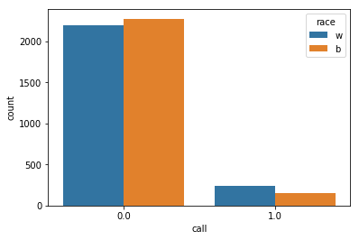

# Examining Racial Discrimination in the US Job Market

### Background
Racial discrimination continues to be pervasive in cultures throughout the world. Researchers examined the level of racial discrimination in the United States labor market by randomly assigning identical résumés to black-sounding or white-sounding names and observing the impact on requests for interviews from employers.

### Data
In the dataset provided, each row represents a resume. The 'race' column has two values, 'b' and 'w', indicating black-sounding and white-sounding. The column 'call' has two values, 1 and 0, indicating whether the resume received a call from employers or not.

Note that the 'b' and 'w' values in race are assigned randomly to the resumes when presented to the employer.

<div class="span5 alert alert-info">
### Exercises
You will perform a statistical analysis to establish whether race has a significant impact on the rate of callbacks for resumes.

Answer the following questions **in this notebook below and submit to your Github account**. 

   1. What test is appropriate for this problem? Does CLT apply?
   2. What are the null and alternate hypotheses?
   3. Compute margin of error, confidence interval, and p-value. Try using both the bootstrapping and the frequentist statistical approaches.
   4. Write a story describing the statistical significance in the context or the original problem.
   5. Does your analysis mean that race/name is the most important factor in callback success? Why or why not? If not, how would you amend your analysis?

You can include written notes in notebook cells using Markdown: 
   - In the control panel at the top, choose Cell > Cell Type > Markdown
   - Markdown syntax: http://nestacms.com/docs/creating-content/markdown-cheat-sheet


#### Resources
+ Experiment information and data source: http://www.povertyactionlab.org/evaluation/discrimination-job-market-united-states
+ Scipy statistical methods: http://docs.scipy.org/doc/scipy/reference/stats.html 
+ Markdown syntax: http://nestacms.com/docs/creating-content/markdown-cheat-sheet
+ Formulas for the Bernoulli distribution: https://en.wikipedia.org/wiki/Bernoulli_distribution
</div>
****


```python
from __future__ import division
import pandas as pd
import numpy as np
from scipy import stats
import seaborn as sns
import warnings
import math
warnings.filterwarnings('ignore')
%matplotlib inline
```


```python
data = pd.io.stata.read_stata('data/us_job_market_discrimination.dta')
#data.head()
```


```python
# data.info()
```


```python
len(data)
```


    4870


```python
data.race.describe()
```


    count     4870
    unique       2
    top          b
    freq      2435
    Name: race, dtype: object


```python
# number of callbacks for black-sounding names
print('Black names call:',np.sum(data[data.race=='b'].call))
print('White names call:',np.sum(data[data.race=='w'].call))
```

    Black names call: 157.0
    White names call: 235.0
    


```python
data.groupby('call').size()
```


    call
    0.0    4478
    1.0     392
    dtype: int64


```python
# narrow down to columns of interest
data = pd.concat([data.race,data.call], axis=1)
print('sample size =',len(data))
data.head()
```

    sample size = 4870
    


<div>
<style scoped>
    .dataframe tbody tr th:only-of-type {
        vertical-align: middle;
    }

    .dataframe tbody tr th {
        vertical-align: top;
    }

    .dataframe thead th {
        text-align: right;
    }
</style>
<table border="1" class="dataframe">
  <thead>
    <tr style="text-align: right;">
      <th></th>
      <th>race</th>
      <th>call</th>
    </tr>
  </thead>
  <tbody>
    <tr>
      <th>0</th>
      <td>w</td>
      <td>0.0</td>
    </tr>
    <tr>
      <th>1</th>
      <td>w</td>
      <td>0.0</td>
    </tr>
    <tr>
      <th>2</th>
      <td>b</td>
      <td>0.0</td>
    </tr>
    <tr>
      <th>3</th>
      <td>b</td>
      <td>0.0</td>
    </tr>
    <tr>
      <th>4</th>
      <td>w</td>
      <td>0.0</td>
    </tr>
  </tbody>
</table>
</div>


```python
# countplot of callbacks for black & white-sounding names
sns.countplot(x=data.call, hue=data.race)
```


    <matplotlib.axes._subplots.AxesSubplot at 0x2d2725fc358>





<div class="span5 alert alert-success">
<h2>SOLUTION: What test is appropriate for this problem?</h2>

<p>This is an interesting question, and it can be argued that there are two possible correct answers (such is life). First note the wording of the question: does race have a *significant impact* on callback. This usually suggests a $\chi^2$-test, but the $\chi^2$-test requires *frequencies* rather than percentages. Interestingly, one of the code snippets above uses frequency so we will look at that in a bit.</p>

For now, a two-sample $z$-test:

$$z = \frac{\left( \hat{p}_W - \hat{p}_B \right) - 0}{\sqrt{\hat{p} (1 - \hat{p)} \left( \frac{1}{n_W} + \frac{1}{n_B}\right)}}$$

where

$$\hat{p} = \frac{y_W + y_B}{n_W + n_B}$$

The null and alternate hypotheses:

$$H_0: p_B = p_W$$
$$H_A: p_B \ne p_W$$

CLT applies because we assume that the samples are representative of the population. The observations in each sample are assumed to be independent since the sample was drawn randomly.


```python
w = data[data.race=='w']
b = data[data.race=='b']

n_w = len(w)
n_b = len(b)

prop_w = np.sum(w.call) / len(w)
prop_b = np.sum(b.call) / len(b)

prop_diff = prop_w - prop_b
phat = (np.sum(w.call) + np.sum(b.call)) / (len(w) + len(b))

z = prop_diff / np.sqrt(phat * (1 - phat) * ((1 / n_w) + (1 / n_b)))
pval = stats.norm.cdf(-z) * 2
print("Z score: {}".format(z))
print("P-value: {}".format(pval))
```

    Z score: 4.108412152434346
    P-value: 3.983886837585077e-05
    


```python
moe = 1.96 * np.sqrt(phat * (1 - phat) * ((1 / n_w) + (1 / n_b)))
ci = prop_diff + np.array([-1, 1]) * moe
print("Margin of Error: {}".format(moe))
print("Confidence interval: {}".format(ci))
```

    Margin of Error: 0.015281912310894095
    Confidence interval: [ 0.01675094  0.04731477]
    

<div class="span5 alert alert-success">
<p>The p-value is practically 0 so we reject the null hypothesis that white and black sounding names have the same callback rate. They do not.</p>

<p>Since 0 is not in the confidence interval, we reject the null hypothesis with the same conclusion.</p>

<h4>SOLUTION: Does your analysis mean that race/name is the most important factor in callback success? Why or why not? If not, how would you amend your analysis?</h4>

<p>No! While our test did show that there is a difference in callback rate based on race alone, there are other variables that may also contribute to, or interact with, race to explain the difference. In the original research paper, the researchers cited geography/city as a confounding variable. Additionally, we could also look at education and experience levels as well. But, in our very narrow example, we have shown that there is a significant difference in callback rates between white people and black people.</p>

<p>The $\chi^2$ approach:</p>
</div>


```python
cont_table = pd.crosstab(index=data.call, columns=data.race)
chi2, pval, _, _ = stats.chi2_contingency(cont_table)
print("Chi-squared test statistic: {}".format(chi2))
print("p-value: {}".format(pval))
```

    Chi-squared test statistic: 16.44902858418937
    p-value: 4.997578389963255e-05
    

<div class="span5 alert alert-success">
The chi-squared test yields a similar result. We reject the null hypothesis that race and callback rate are independent. The margin of error and confidence interval calculations are a bit more complicated because the chi-squared distribution is not always symmetric, depending on the number of degrees of freedom.
</div>


### Answer to Question 1&2:

#### 1.Based on the number of samples this should be a z-test. Since the names is randomly selected, I am going to assume the CLT applies. (I do not know how to correctly test this assumpation, last mini project I can use body tempature, but I do not know which feature to analyze in this one)
#### 2.the null hypotheses indicates there is no racial discrimination going on in the employment, the alternative hypotheses indicates thta race does matter in the employment.


```python
white = data[data.race=='w'].call
black = data[data.race=='b'].call

diff = np.sum(white) - np.sum(black)
print('Acutal Difference:',diff)

bs_times = 10000

bs_diff = np.empty(bs_times)

for i in range(bs_times):
    bs_white = np.random.choice(white, len(white))
    bs_black = np.random.choice(black, len(black))
    
    bs_diff[i] = np.sum(bs_white) - np.sum(bs_black)
    
print('95% Confidence Interval:',np.percentile(bs_diff, [2.5, 97.5]))
```

    Acutal Difference: 78.0
    95% Confidence Interval: [  41.  115.]
    


```python
permu_times = 100000

conc_sample = np.concatenate((white,black))

perm_diff = np.empty(permu_times)
for i in range(permu_times):
    perm_all = np.random.permutation(conc_sample)
    permu_white = perm_all[:len(white)]
    permu_black = perm_all[len(white):]
    perm_diff[i] = np.sum(permu_white)-np.sum(permu_black)

print('p value for null hypotheses:',np.sum(perm_diff>diff)/len(perm_diff))
```

    p value for null hypotheses: 1e-05
    

#### Answer to Question 3, 4 & 5:

##### 3.I am not sure how to compute margin of error. For the call rate difference between balck and white, the actual value is 78, the 95% confidence interval using bootstrap is [41, 116], and p value is close to 0.

##### 4.I conducted an analysis based on the given data, a total of 2435 black names and 2435 white names are used, and 157 black names get called, and 235 white names get called. The difference between them is 78, using bootstrap technic it is concluded that the 95% confidence interval for this value is [41, 116], and p value for the null hypotheses that race does not affect callback rate is 0 when simulated using permuation for ten thousand times, this indicates a high unlikely for null hyoitheses to stand, and race does influence the call back rate.

##### 5.With above being said, we cannot conclude the race/name is the most important factor in this experiment. For example, although the names are randomly assigned, it could be the case that resumes with white names have higher working experience on average than those with black names. In order to clarify this, I need to test the null hypotheses that resumes with white and black names have same distribution in other features (education, work experience, etc.)
